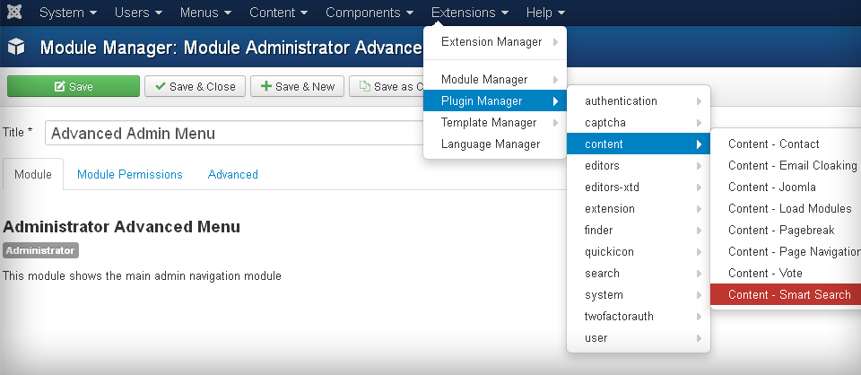

The advanced menu for the **Joomla 3** Admin side. Based on the default **mod_menu** module. 

If you'd like to make a donation via **PayPal** or with a **Credit Card**:  

Adds the following possibilities:

 - open menu items on mouse hover action;
 - select existing components configurations from the menu;
 - view all the frontend menu items in the Menus item without entering the Menus component page;
 - direct acces to some of the **Extension Manager** views;
 - access to the **Admin/Site** modules component views and add new modules from the main menu;
 - view the list of plugin folders and appropriate plugins inside them;
 - view the list and access to the **Styles** and **Templates** views;
 - show the status of different components, plugins, menu items;

Also the menu is active when an element is in the editing state.

### Usage:
1. Download the **.zip*.
2. Go to the *Extensions -> Extension Manager* in the admin Joomla part.
3. Drag the zip onto the upload field and **Upload & Install**.
4. Go to the *Extensions -> Module Manager -> Administrator*.
5. Click on the **Advanced Admin Menu module**.
6. Select the **menu** position and **Publish** it.
7. Save & Close.
8. Disable the **Admin Menu** module.
9. Test the new module.
